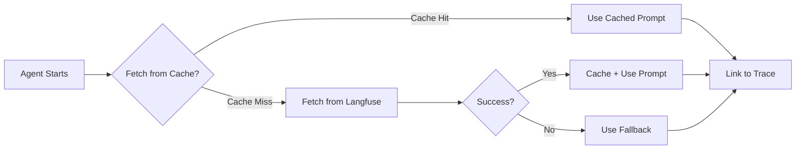

# Observability & Prompt Management

## Quick Reference

| Task                       | Code Example                                                                   |
| -------------------------- | ------------------------------------------------------------------------------ |
| **Fetch a prompt**         | `const { text, tracingOptions } = await getPrompt(PROMPTS.JOB_CLASSIFIER)`     |
| **Fetch specific version** | `await getPrompt({ name: "job-classifier", version: 2, fallbackText: "..." })` |
| **Clear cache**            | `clearPromptCache()`                                                           |
| **Add new prompt**         | Add to `PROMPTS` in `prompts.ts` + create in Langfuse UI                       |
| **View traces**            | https://cloud.langfuse.com → Traces                                            |
| **Manage prompts**         | https://cloud.langfuse.com → Prompts                                           |

## Overview

The `src/observability/` module provides centralized observability and prompt management for the application using Langfuse.

### Key Features

- **📊 Tracing**: Complete observability for agents, workflows, and LLM calls
- **📝 Prompt Management**: Version-controlled prompts with instant deployment
- **📈 Quality Scoring**: Automated evaluation metrics (relevancy, toxicity, bias, hallucination)
- **🚀 Zero Latency**: Client-side prompt caching for production performance
- **🔄 Decoupled Deployment**: Update prompts without code changes or deployments

## Module Structure

```
src/observability/
├── index.ts          # Observability config + prompt management exports
├── prompts.ts        # Prompt fetching, caching, and fallback logic
└── README.md         # This documentation
```

## Why Langfuse Prompt Management?

### Decouple Prompt Updates from Code Deployment

Instead of hardcoding prompts in your application, Langfuse allows you to:

- **Update prompts instantly** without engineering involvement or deployments
- **Iterate faster** - Product managers and domain experts can refine prompts directly in the UI
- **Version control** - Track every change with automatic versioning
- **A/B test** - Deploy multiple prompt versions and compare performance across environments

**Traditional approach:** Prompt change → Code change → Review → Deploy (hours/days)  
**Langfuse approach:** Update prompt in UI → Auto-deployed (seconds)

### No Latency, No Availability Risk

Langfuse Prompt Management adds **zero latency** to your application:

- Prompts are **cached client-side** by the SDK
- Retrieving prompts is as fast as reading from memory
- Your application continues working even if Langfuse is temporarily unavailable (uses fallbacks)

## Core Concepts

### Prompt Types

- **Text**: Simple string prompts (most common)
- **Chat**: Structured messages with roles (system, user, assistant)

### Versioning

- Every prompt change creates a new version automatically
- Versions are immutable and numbered sequentially
- Fetch latest version or specific version by number

### Labels

- Tag versions with labels like `production`, `staging`, `experimental`
- Control which version is used in different environments
- Multiple labels supported per version

### Configuration

- Store model parameters, temperature, tokens alongside prompts
- Keep all LLM config in one place for easy experimentation

## Getting Started

### 1. Create Prompts in Langfuse UI

1. **Login to Langfuse**  
   Go to https://cloud.langfuse.com

2. **Navigate to Prompts**  
   Click "Prompts" in sidebar → "New Prompt"

3. **Create the Prompt**
   - **Name**: `job-classifier` (must match code)
   - **Type**: Text
   - **Prompt Content**:
     ```
     You are an expert at classifying job postings. You can analyze job titles,
     locations, and descriptions to determine if they are remote EU jobs, UK remote
     jobs, or other types of positions. You understand geographical nuances like
     EMEA vs EU, timezone requirements, and work authorization implications.
     ```
   - Click "Create"

4. **Set Labels (Optional)**
   - Tag version as `production` to mark it as the production-ready version
   - Use labels like `staging`, `experimental` for different environments
   - The SDK can fetch by label: `langfuse.getPrompt("job-classifier", { label: "production" })`
5. How It Works



**On Agent Initialization:**

1. Agent calls `getPrompt(PROMPTS.JOB_CLASSIFIER)`
2. Check in-memory cache first (instant)
3. If not cached, fetch from Langfuse API
4. Cache the result for subsequent calls
5. If fetch fails, use hardcoded fallback
6. Return prompt text + tracing options

**During Generation:**

- All LLM calls are automatically linked to the prompt version used
- Langfuse dashboard shows which prompt version generated which output
- Enables prompt performance analysis and A/B testing

### 3. Performance & Analytics

**Automatic Metrics by Prompt Version:**

- ✅ Token usage
- ✅Code Integration
- ✅ Cost tracking
- ✅ Quality scores (relevancy, toxicity, bias, hallucination)
- ✅ User feedback and annotations

**Prompt Performance Analysis:**

```typescript
// In Langfuse dashboard, compare:
// - Prompt v1 vs v2 token efficiency
// - Which version has better relevancy scores
// - Cost differences between versions
// - User feedback by prompt version
```

### 4. Advanced Usage

#### Fetch Specific Versions

```typescript
// Fetch version 2 explicitly
const { text, tracingOptions } = await getPrompt({
  name: "job-classifier",
  version: 2,
  fallbackText: "...",
});
```

#### A/B Testing Prompts

```typescript
// Deploy two agents with different prompt versions
const agentA = createAgent(await getPrompt({ name: "prompt-v1", ... }));
const agentB = createAgent(await getPrompt({ name: "prompt-v2", ... }));

// Route 50% traffic to each, compare metrics in Langfuse
```

#### Environment-based Labels

```typescript
// In production
const prompt = await langfuse.getPrompt("job-classifier", {
  label: "production",
});

// In staging
const prompt = await langfuse.getPrompt("job-classifier", {
  label: "staging",
});
```

const prompt = await langfuse.getPrompt("job-classifier", 2); // version 2

````

#### A/B Testing

Deploy multiple agents with different prompt versions and compare metrics in Langfuse dashboard.

## Using Prompt Management

### Basic Usage

```typescript
import { getPrompt, PROMPTS } from "@/observability";

// Fetch a predefined prompt
**Client-side caching** ensures zero-latency prompt retrieval:

```typescript
import { clearPromptCache } from "@/observability";

// Clear all cached prompts (forces refetch from Langfuse on next request)
clearPromptCache();

// Useful when:
// - Testing prompt updates locally
// - Forcing immediate prompt refresh
// - Debugging prompt issues
````

**Cache behavior:**

- Prompts are cached in-memory by `(name, version)` key
- Cache persists for application lifetime
- No external & Analysis

### Langfuse Dashboard

Access at https://cloud.langfuse.com

**Traces**

- View all agent and workflow executions
- See input/output, latency, token usage, cost
- Filter by prompt version, environment, user
- Debug failures and unexpected outputs

**Prompts**

- Navigate to **Prompts → job-classifier**
- View all versions and their deployment history
- See usage analytics per version:
  - Total generations
  - Average tokens
  - Cost
  - Quality scores
- Compare versions side-by-side

**Scores**

- Agent scorers automatically tracked:
  - Answer Relevancy (25% sampling)
  - Toxicity (100% sampling)
  - Bias (25% sampling)
  - Hallucination (25% sampling)
- View score trends over time
- Filter by prompt version to see quality impact

**Sessions**

- Group related traces by session ID
- Track multi-turn conversations
- Analyze user journeys

### Best Practices

1. **Version Control**: Always test new prompts in staging before production
2. **Labels**: Use `production`, `staging`, `dev` labels to manage deployments
3. **Monitoring**: Set up alerts for quality score degradation
4. **Iteration**: Use Langfuse metrics to guide prompt improvements
5. **Fallbacks**: Always provide meaningful fallback text for offline scenarios
6. **Documentation**: Document prompt intent and expected behavior in Langfuse

### Troubleshooting

**Prompt not updating in app?**

- Check if prompt is labeled `production` (if fetching by label)
- Clear prompt cache: `clearPromptCache()`
- Verify environment variables are set

**Langfuse unavailable?**

- Application continues with fallback prompts
- Check logs for fetch errors
- Verify LANGFUSE_BASE_URL is correct

**Tracing not linked to prompts?**

- Ensure `tracingOptions` is passed to agent's `defaultGenerateOptions`
- Verify prompt was fetched successfully (check for fallback warnings)

## Resources

- [Langfuse Prompt Management Docs](https://langfuse.com/docs/prompts)
- [Langfuse Tracing](https://langfuse.com/docs/tracing)
- [Caching Details](https://langfuse.com/docs/prompts/get-started#caching)
- [Version Control Guide](https://langfuse.com/docs/prompts/concepts#versioning)

```typescript
import { getPrompt } from "@/observability";

const { text, tracingOptions } = await getPrompt({
  name: "my-custom-prompt",
  fallbackText: "Fallback instructions if Langfuse is unavailable",
});
```

### Specific Versions

```typescript
const { text, tracingOptions } = await getPrompt({
  name: "job-classifier",
  version: 2, // Fetch version 2 specifically
  fallbackText: "...",
});
```

### Adding New Prompts

1. Add to `PROMPTS` constant in `prompts.ts`:

```typescript
export const PROMPTS = {
  JOB_CLASSIFIER: {
    name: "job-classifier",
    fallbackText: "...",
  },
  MY_NEW_PROMPT: {
    name: "my-new-prompt",
    fallbackText: "...",
  },
} as const;
```

2. Create the prompt in Langfuse dashboard with the same name

### Cache Management

```typescript
import { clearPromptCache } from "@/observability";

// Clear all cached prompts (forces refetch from Langfuse)
clearPromptCache();
```

## Environment Variables

Ensure these are set in `.env`:

```env
LANGFUSE_SECRET_KEY="***REMOVED***"
LANGFUSE_PUBLIC_KEY="***REMOVED***"
LANGFUSE_BASE_URL="https://cloud.langfuse.com"
```

## Monitoring

- **Dashboard**: View all traces at https://cloud.langfuse.com
- **Prompts**: Navigate to Prompts → job-classifier to see usage analytics
- **Scores**: Agent scorers (relevancy, toxicity, bias, hallucination) appear in traces
- **Sessions**: Group related traces by session ID for conversation tracking
