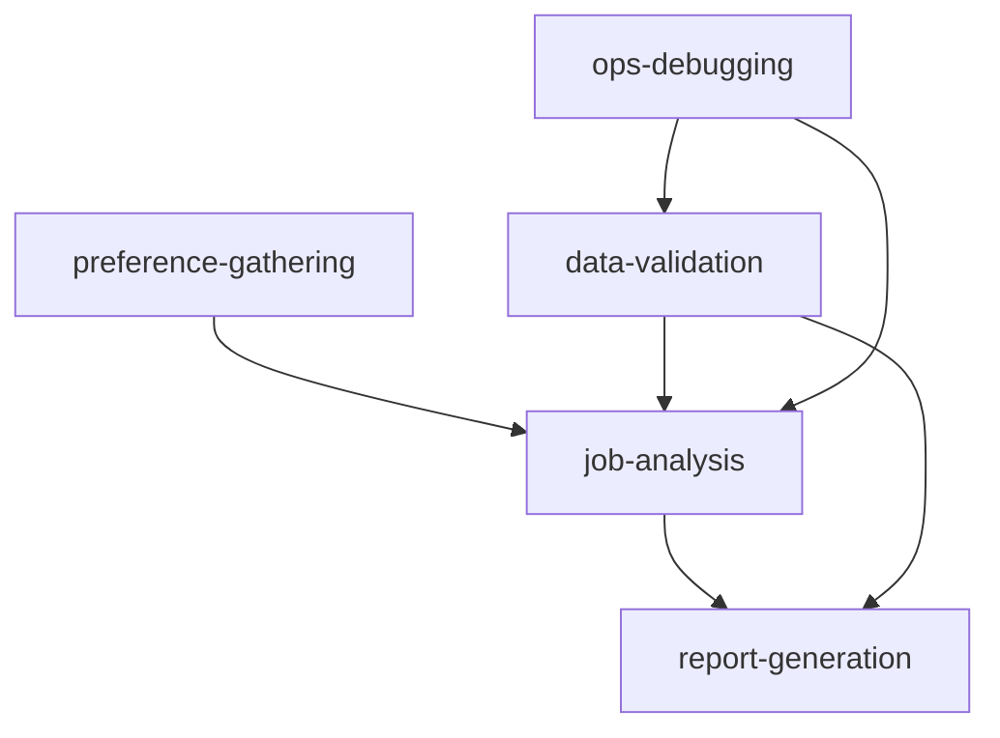

# Workspace Skills

This directory contains **Agent Skills** - reusable instructions that teach agents how to perform specific tasks. Skills follow the [Agent Skills specification](https://github.com/agentic-labs/agent-skills) - an open standard for packaging agent capabilities.

## What are Skills?

Skills are structured instructions with supporting materials that help agents:

- Perform complex tasks consistently
- Access domain knowledge and best practices
- Execute scripts and reference documentation
- Maintain quality standards

## Available Skills

### 📊 [job-analysis](./job-analysis/)

Analyze job postings to extract key information and determine remote EU compatibility. Includes salary benchmarking, skill extraction, and quality assessment.

**When to use:** Analyzing job descriptions, classifying remote eligibility, extracting requirements

**Tags:** `jobs`, `analysis`, `remote-work`, `classification`

---

### 💬 [preference-gathering](./preference-gathering/)

Help users articulate job search preferences through structured, conversational dialogue. Captures preferences with confidence levels.

**When to use:** Onboarding new users, updating preferences, clarifying unclear requirements

**Tags:** `onboarding`, `preferences`, `user-input`, `conversation`

---

### ✅ [data-validation](./data-validation/)

Validate data quality and integrity for job postings, user inputs, and system data. Ensures consistency and catches errors early.

**When to use:** Validating user input, checking job data quality, debugging inconsistencies

**Tags:** `validation`, `data-quality`, `debugging`, `quality-assurance`

---

### 📈 [report-generation](./report-generation/)

Generate comprehensive reports and analyses from platform data. Creates job match reports, market analyses, and data quality reports.

**When to use:** Creating user reports, market insights, operational metrics, comparisons

**Tags:** `reporting`, `analytics`, `insights`, `visualization`

---

### 🔧 [ops-debugging](./ops-debugging/)

Debug operational issues, investigate anomalies, and troubleshoot system problems. Systematic approach to incident response.

**When to use:** Investigating bugs, debugging classification issues, incident response

**Tags:** `operations`, `debugging`, `troubleshooting`, `admin`

---

## Skill Structure

Each skill is a folder containing:

```
skill-name/
  SKILL.md          # Main skill instructions and metadata
  references/       # Supporting documentation (optional)
    *.md
    *.json
  scripts/          # Executable scripts (optional)
    *.ts
    *.py
  assets/           # Images and other files (optional)
```

### SKILL.md Format

Every `SKILL.md` follows this structure:

```markdown
---
name: skill-name
description: Brief description of what the skill does
version: 1.0.0
tags:
  - tag1
  - tag2
---

# Skill Name

Detailed instructions for the agent...

## When to Use This Skill

- Trigger condition 1
- Trigger condition 2

## Instructions

Step-by-step guidance...

## Related Skills

Links to complementary skills...

## References

Documentation in `references/` folder...
```

## How Agents Use Skills

1. **Discovery**: Skills are indexed automatically when workspace initializes
2. **Search**: BM25 search helps agents find relevant skills
3. **Activation**: Agents activate skills to add instructions to context
4. **Execution**: Agents follow skill instructions and use references/scripts

Skills are automatically available to:

- `workspace` - Main workspace for general agents
- `opsWorkspace` - Admin assistant workspace
- Any workspace with `skills: ["/skills"]` configuration

## Creating New Skills

### 1. Create the folder structure

```bash
mkdir -p src/workspace/skills/my-skill/{references,scripts,assets}
```

### 2. Write SKILL.md

Follow the template above. Include:

- Clear frontmatter with name, description, version, tags
- When to use this skill
- Step-by-step instructions
- Examples and best practices
- References to supporting materials

### 3. Add supporting materials (optional)

- **references/**: Markdown docs, JSON schemas, lookup tables
- **scripts/**: TypeScript/Python scripts for automation
- **assets/**: Images, PDFs, or other files

### 4. Test the skill

```typescript
import { workspace } from "./src/workspace";

// Initialize workspace (indexes skills)
await workspace.init();

// Skills are now discoverable by agents
```

## Skill Development Best Practices

### ✅ Do:

- Write clear, actionable instructions
- Include examples and templates
- Specify when to use the skill
- Link to related skills
- Keep instructions focused on one task
- Update version when making changes
- Add references for complex topics

### ❌ Don't:

- Create overly broad skills (split into multiple focused skills)
- Include sensitive data in references
- Make skills agent-specific (keep them reusable)
- Forget to update version numbers
- Use markdown code blocks in SKILL.md frontmatter
- Duplicate content across skills (use references)

## Skill Relationships



- **preference-gathering** → Captures what users want
- **job-analysis** → Analyzes jobs against preferences
- **data-validation** → Ensures data quality
- **report-generation** → Creates insights from analyzed data
- **ops-debugging** → Investigates issues across all skills

## Search and Indexing

Skills are automatically indexed with **BM25** when the workspace initializes.

Agents can search across:

- Skill names and descriptions
- Instruction content
- Reference documentation
- Tags and metadata

Example agent query:

> "How do I classify a job as remote EU compatible?"

Will find: `job-analysis` skill with remote work classification instructions

## Maintenance

### Updating Skills

1. Edit the skill files
2. Increment version in frontmatter
3. Document changes in skill or commit message
4. Restart workspace to reindex

### Deprecating Skills

1. Add `deprecated: true` to frontmatter
2. Include migration instructions
3. Remove after transition period

### Monitoring Usage

Check workspace logs for:

- Which skills are activated most
- Which searches return no results (gaps in coverage)
- Agent errors when using skills (instruction clarity issues)

## Related Documentation

- [Workspace Overview](../README.md)
- [Agent Skills Specification](https://github.com/agentic-labs/agent-skills)
- [Mastra Skills Documentation](https://mastra.ai/docs/workspace/skills)

## Contributing

When adding new skills:

1. Follow the folder structure convention
2. Use the SKILL.md template
3. Add relevant tags for discoverability
4. Link to related skills
5. Include examples and references
6. Update this README with the new skill

---

**Total Skills:** 5  
**Last Updated:** February 8, 2026  
**Search:** Enabled (BM25)
